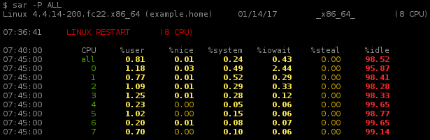
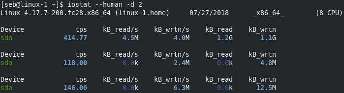
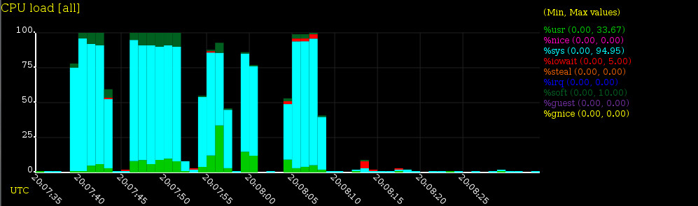
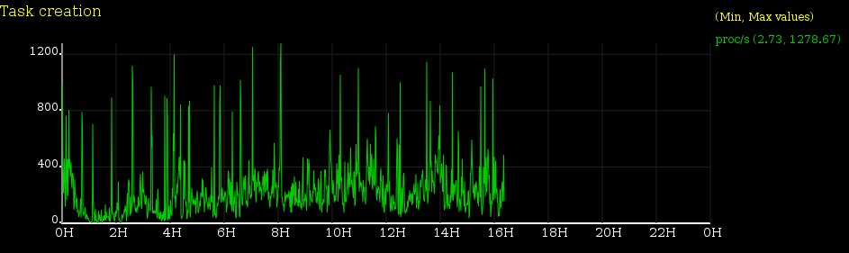
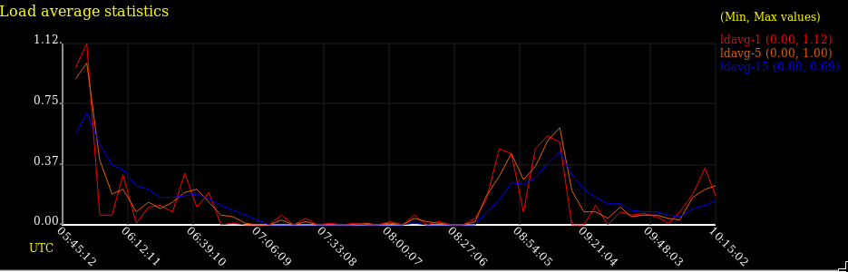

## sysstat - System performance tools for the Linux operating system
[](https://scan.coverity.com/projects/sysstat-sysstat)
[](https://travis-ci.org/sysstat/sysstat)
[](https://lgtm.com/projects/g/sysstat/sysstat/context:cpp)
[](https://lgtm.com/projects/g/sysstat/sysstat/alerts)
[](https://www.paypal.com/cgi-bin/webscr?cmd=_s-xclick&hosted_button_id=45U6F9R73ESFQ)

(C) 1999-2020 Sebastien GODARD (sysstat (at) orange (dot) fr)

### Introduction

The sysstat package contains various utilities, common to many commercial Unixes, to monitor system performance and usage activity:

* **iostat** reports CPU statistics and input/output statistics for block devices and partitions.
* **mpstat** reports individual or combined processor related statistics.
* **pidstat** reports statistics for Linux tasks (processes) : I/O, CPU, memory, etc.
* **tapestat** reports statistics for tape drives connected to the system.
* **cifsiostat** reports CIFS statistics.

Sysstat also contains tools you can schedule via cron or systemd to collect and historize performance and activity data:

* **sar** collects, reports and saves system activity information (see below a list of metrics collected by sar).
* **sadc** is the system activity data collector, used as a backend for sar.
* **sa1** collects and stores binary data in the system activity daily data file. It is a front end to sadc designed to be run from cron or systemd.
* **sa2** writes a summarized daily activity report. It is a front end to sar designed to be run from cron or systemd.
* **sadf** displays data collected by sar in multiple formats (CSV, XML, JSON, etc.) and can be used for data exchange with other programs. This command can also be used to draw graphs for the various activities collected by sar using SVG (Scalable Vector Graphics) format.

Default sampling interval is 10 minutes but this can be changed of course (it can be as small as 1 second).

#### System statistics collected by sar:
- Input / Output and transfer rate statistics (global, per device, per partition and per network filesystem)
- CPU statistics (global and per CPU), including support for virtualization architectures
- Memory, hugepages and swap space utilization statistics
- Virtual memory, paging and fault statistics
- Process creation activity
- Interrupt statistics (global, per CPU and per interrupt, including potential APIC interrupt sources, hardware and software interrupts)
- Extensive network statistics: network interface activity (number of packets and kB received and transmitted per second, etc.) including failures from network devices; network traffic statistics for IP, TCP, ICMP and UDP protocols based on SNMPv2 standards; support for IPv6-related protocols
- Fibre Channel traffic statistics
- Software-based network processing (softnet) statistics
- NFS server and client activity
- Sockets statistics
- Run queue and system load statistics
- Kernel internal tables utilization statistics
- Swapping statistics
- TTY devices activity
- Power management statistics (instantaneous and average CPU clock frequency, fans speed, devices temperature, voltage inputs)
- USB devices plugged into the system
- Filesystems utilization (inodes and blocks)
- Pressure-Stall Information statistics

#### Sysstat key features:
- Display average statistics values at the end of the reports.
- On-the-fly detection of new devices (disks, network interfaces, etc.) that are created or registered dynamically.
- Support for UP and SMP machines, including machines with hyperthreaded or multi-core processors.
- Support for hotplug CPUs (it detects automagically processors that are disabled or enabled on the fly) and tickless CPUs.
- Works on many different architectures, whether 32- or 64-bit.
- Needs very little CPU time to run (written in C).
- System statistics collected by sar/sadc can be saved in a file for future inspection. You can configure the length of data history to keep. There is no limit for this history length but the available space on your storage device.
- System statistics collected by sar/sadc can be exported in various different formats (CSV, XML, JSON, SVG, etc.). DTD and XML Schema documents are included in sysstat package. JSON output format is also available for mpstat and iostat commands.
- iostat can display statistics for devices managed by drivers in userspace like spdk.
- Smart color output for easier statistics reading.


- Internationalization support (sysstat has been translated into numerous different languages). Sysstat is now part of the [Translation Project](http://translationproject.org/).
- Sysstat commands can automatically select the unit used to display sizes for easier reading (see option `--human`):



- Graphs can be generated (SVG format - Scalable Vector Graphics) and displayed in your favorite web browser. See some sample screenshots below:








Sysstat is Open Source / Free Software, and is freely available under the GNU General Public License, version 2.
The latest version of sysstat can always be found on my web site at:

[http://pagesperso-orange.fr/sebastien.godard/](http://pagesperso-orange.fr/sebastien.godard/)

See the CHANGES file to know the new features/improvements/bug fixes added
in this release of sysstat.
Sysstat development can be tracked on [GitHub](https://github.com/sysstat/sysstat).

### Installation

#### Install from RHEL/Fedora/CentOS

Enter:

```
$ sudo yum install sysstat
```

CentOS and Fedora systems call the collector process using a cron job in /etc/cron.d and it's enabled by default.
On recent versions, systemd is used instead of cron. You may need to enable and start the sysstat service:

```
$ sudo systemctl enable sysstat
$ sudo systemctl start sysstat
```

#### Install from Ubuntu

Enter:

```
$ sudo apt-get install sysstat
```

Then enable data collecting:

```
$ sudo vi /etc/default/sysstat
change ENABLED="false" to ENABLED="true"
save the file
```

Last, restart the sysstat service:

```
$ sudo service sysstat restart
```

#### Install from sources

Clone sysstat public repository with:

```
$ git clone git://github.com/sysstat/sysstat
```

Then configure sysstat for your system:

```
$ cd sysstat
$ ./configure
```

You can set several variables and parameters on the command line. For example you
can enter the following option to activate data collecting (either using cron or systemd):

```
$ ./configure --enable-install-cron
```

Enter `./configure --help` to display all possible options.  
Note: There is another way to configure sysstat instead of entering `./configure`:
This is the **Interactive Configuration script** (_iconfig_) which will ask you
for the value of the main sysstat variables and parameters.
Enter `./iconfig` then answer the questions or enter Return to accept
the (sane) default values. For yes/no questions, answer 'y' or 'n'
(without the quotes): It is case sensitive! You can also enter '?' to get
a help message that will explain the meaning of each variable or parameter.

Compile and install:

```
$ make
$ sudo make install
```

### Feedback welcome!

Please use the BUG_REPORT template file to report a bug: It contains important data
that should be provided for this.
Please also remember to read the FAQ that comes with sysstat or is available
from the Wiki page on GitHub.

Opening an issue or a pull request on GitHub is the preferred way to report a bug or submit a patch.
Patches and suggestions for improvements are always welcome!

### Support sysstat!

If you are reading this README file then you are probably about to use the sysstat tools
to help you monitor your system and maybe troubleshoot some performance issues. Good choice.
Sysstat is made for you. Moreover sysstat is free software and always will be.

Yet have you ever considered making a donation to sysstat, regardless of how much your
contribution is? This in turn would encourage me to keep up the work as good as it can be...
Oh, and it would certainly also help me explain to my wife why I spend so much time in front
of my computer instead of taking care of the household ;-)

Click on the "Donate PayPal" button above at the beginning of this file.
You can also make a donation [from my web page](http://pagesperso-orange.fr/sebastien.godard/).

Enjoy!

--

Sebastien GODARD - sysstat (at) orange (dot) fr

